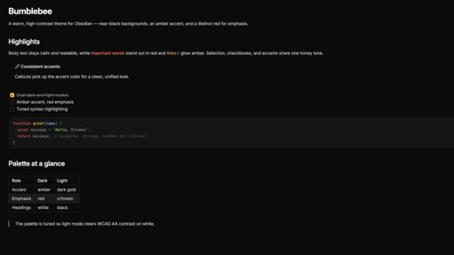

# Bumblebee

A warm, high-contrast theme for [Obsidian](https://obsidian.md) — near-black backgrounds, an amber accent, and a distinct red for emphasis. Ships with both **dark** and **light** modes.

## Features

- **Dark and light modes.** Dark is the primary design target; light mode uses darker accent variants to meet WCAG AA contrast on white.
- **Amber accent, red emphasis.** The accent (amber) is reserved for interactive elements — links, checkboxes, selection. Bold text gets a dedicated red so "important" never reads as "clickable".
- **Code syntax highlighting** tuned for the palette, with distinct colors for keywords, functions, strings, properties, numbers, and comments.
- **Style Settings support.** Install the [Style Settings](https://github.com/mgmeyers/obsidian-style-settings) plugin to toggle callout styles, header underlines, per-header colors, and Kanban accents.
- **Kanban styling** for the [Kanban](https://github.com/mgmeyers/obsidian-kanban) plugin.

## Installation

### From the community themes (recommended)

1. Open **Settings → Appearance → Themes → Manage**.
2. Search for **Bumblebee** and click **Install and use**.

### Manual

1. Create a folder `Bumblebee` in your vault's `.obsidian/themes/` directory.
2. Download `manifest.json` and `theme.css` from the [latest release](https://github.com/KulySocc/obsidian-bumblebee/releases) into that folder.
3. Enable it under **Settings → Appearance → Themes**.

## Customization

With the **Style Settings** plugin enabled, open **Settings → Style Settings → Bumblebee** to adjust callouts, header underlines, header colors, and Kanban accents.

## Credits

Bumblebee is a recolor of **[GitHub Theme](https://github.com/krios2146/obsidian-theme-github)** by [@krios2146](https://github.com/krios2146), used under the MIT License. The structural CSS and Style Settings scaffolding are derived from that theme; the Bumblebee palette and the design decisions behind it are documented in [`CONTEXT.md`](CONTEXT.md) and [`docs/adr/`](docs/adr/).

## License

[MIT](LICENSE). Copyright © 2023 Vladimir Kidyaev (original theme) and © 2026 KulySocc (recolor).
